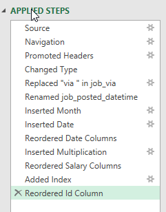
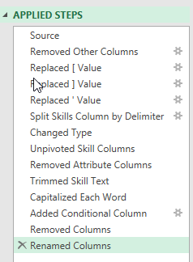
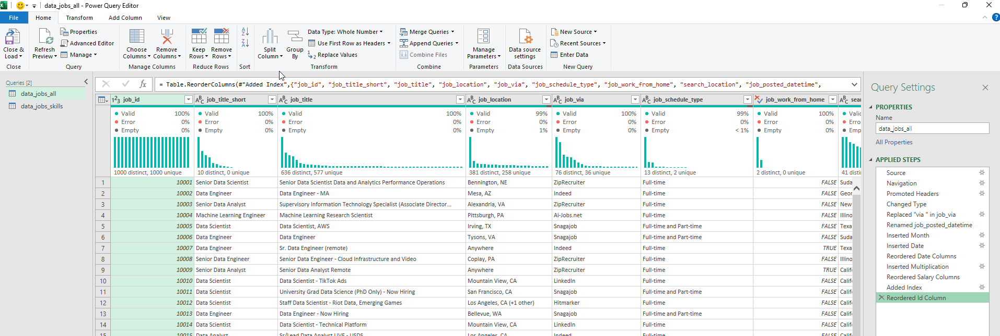
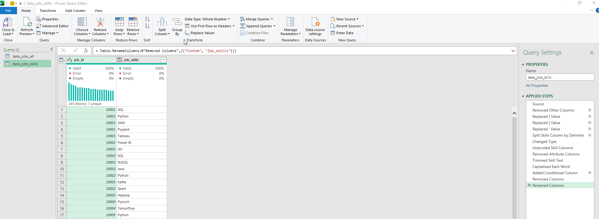
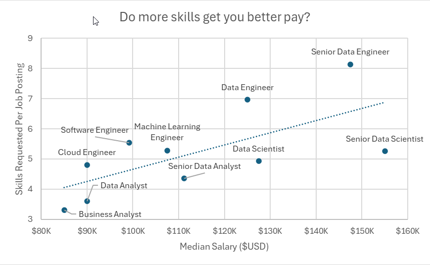
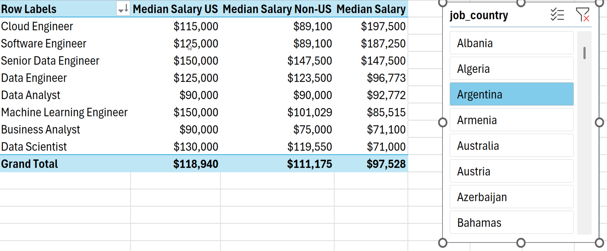
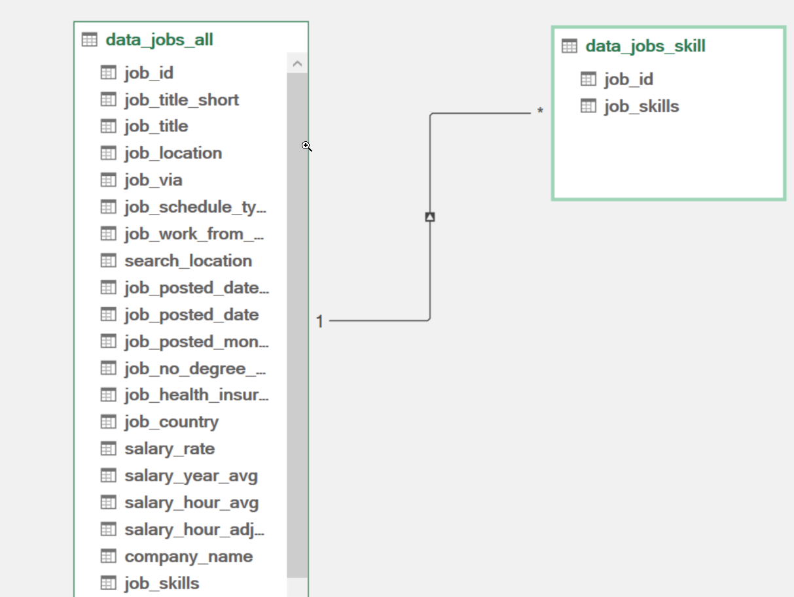
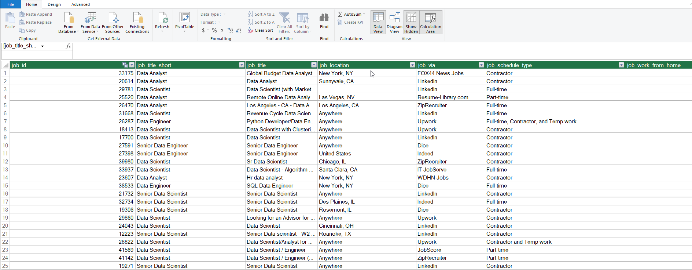
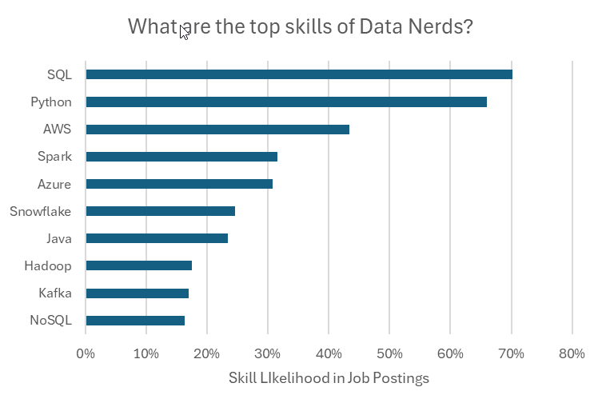
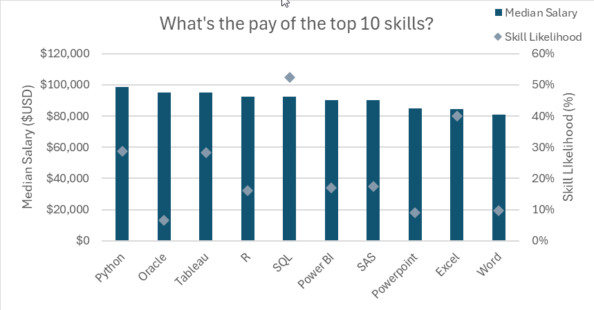

# Project 2 Analysis

## Introduction
This analysis was created as part of [Luke’s Excel course](https://www.youtube.com/watch?v=pCJ15nGFgVg&t) to explore the skills most in demand for data analysts and how these skills impact salaries. Using 2023 job market data, it provides insights into which abilities can boost earning potential and help guide professional development.

## Dataset 
Here is my dataset [Data_Science_Skill_Analysis.xlsx](./Data_Science_Skill_Analysis.xlsx)

### Questions to Analyze
To understand the data science job market, I asked the following:
1. **Do more skills get you better pay?**
2. **What’s the salary for data jobs in different regions?**
3. **What are the top skills of data professionals?**
4. **What’s the pay for the top 10 skills?**

### Excel Skills Used
The following Excel skills were utilized for analysis:
- 📊 **Pivot Tables**
- 📈 **Pivot Charts**
- 🧮 **DAX (Data Analysis Expressions)**
- 🔍 **Power Query**
- 💪 **Power Pivot**

### Data Jobs Dataset
The dataset used for this project contains real-world data science job information from 2023. The dataset is available via my Excel course, which provides a foundation for analyzing data using Excel.

It includes detailed information on:
- 👨‍💼 **Job titles**
- 💰 **Salaries**
- 📍 **Locations**
- 🛠️ **Skills**

## 1️⃣ Do more skills get you better pay?

### 🔍 Skill: Power Query (ETL)
#### 📥 Extract
I first used Power Query to extract the original data **(data_salary_all.xlsx)** and create two queries:
- 🗃️ First one with all the data jobs information.
- 🔧 The second listing the skills for each job ID.

#### 🔄 Transform
Then, I transformed each query by changing column types, removing unnecessary columns, cleaning text to eliminate specific words, and trimming excess whitespace.
- 📊 data_jobs_all

- 🛠️ data_job_skills

#### 🔗 Load
Finally, I loaded both transformed queries into the workbook, setting the foundation for my subsequent analysis.

- 📊 data_jobs_all

- 🛠️ data_job_skills

### 📊 Analysis
#### 💡 Insights
- 📈 There is a positive correlation between the number of skills requested in job postings and the median salary, particularly in roles like Senior Data Engineer and Data Scientist.
- 💼 Roles that require fewer skills, like Business Analyst, tend to offer lower salaries, suggesting that more specialized skill sets command higher market value.

#### 🤔 So What
- This trend emphasizes the value of acquiring multiple relevant skills, particularly for individuals aiming for higher-paying roles.

## 2️⃣ What’s the salary for data jobs in different regions?

### 🧮 Skills: PivotTables & DAX
#### 📈Pivot Table
- 🔢 I created a PivotTable using the Data Model I created with Power Pivot.
- 📊 I moved the job_title_short to the rows area and **salary_year_avg** into the values area.
- 🧮 Then I added new measure to calculate the median salary for United States jobs.
<pre lang="markdown"> =CALCULATE(
    MEDIAN(data_jobs_all[salary_year_avg]),
    data_jobs_all[job_country] = "United States")
</pre>

#### 🧮 DAX
- To calculate the median year salary I used DAX.
<pre lang="markdown"> Median Salary := MEDIAN(data_jobs_all[salary_year_avg]) </pre>  

### 📊 Analysis
#### 💡 Insights
- 💼 Job roles like Senior Data Engineer and Data Scientist command higher median salaries both in the US and internationally, showcasing the global demand for high-level data expertise.
- 💰 The salary disparity between US and Non-US roles is particularly notable in high-tech jobs, which might be influenced by the concentration of tech industries in the US.

#### 🤔 So What
- These salary insights are important for planning and salary negotiations, helping professionals and companies align their offers with market standards while considering geographical variations.

## 3️⃣ What are the top skills of data professionals?

### 🔧 Skill: Power Pivot
#### 💪 Power Pivot
- 🔗 I created a data model by integrating the **data_jobs_all** and **data_jobs_skills** tables into one model.
- 🧹 Since I had already cleaned the data using Power Query; Power Pivot created a relationship between these two tables.

#### 🔗 Data Model
- I created a relationship between my two tables using the **job_id** column.

#### 📃 Power Pivot Menu
- The Power Pivot menu was used to refine my data model and makes it easy to create measures.

### 📊Analysis
#### 💡Insights
- 💻 SQL and Python dominate as top skills in data-related jobs, reflecting their foundational role in data processing and analysis.
- ☁️ Emerging technologies like AWS and Azure also show significant presence, underlining the industry's shift towards cloud services and big data technologies.

#### 🤔So What
- Understanding prevalent skills in the industry not only helps professionals stay competitive but also guides training and educational programs to focus on the most impactful technologies.

## 4️⃣ What’s the pay of the top 10 skills?
### 📊 Skill: Advanced Charts (Pivot Chart)
#### 📈 PivotChart
- I created a combo PivotChart to plot median salary and skill likelihood (%) from my PivotTable.
    - **Primary Axis:** Median Salary (as a Clustered Column)
    - **Secondary Axis:** Skill Likelihood (as a Line with Markers)
- To customize the chart, I added a title axis title, removed the lines (skill likelihood), and changed the markers to diamonds.

### 📊 Analysis
#### 💡Insights
- 💰 Higher median salaries are associated with skills like Python, Oracle, and SQL, suggesting their critical role in high-paying tech jobs.
- 📉 Skills like PowerPoint and Word have the lowest median salaries and likelihood, indicating less specialization and demand in high-salary sectors.

#### 🤔So What
- This chart highlights the importance of investing time in learning high-value skills like Python and SQL, which are evidently tied to higher paying roles, especially for those looking to maximize their salary in the tech industry.

## Conclusion
As part of [Luke’s Excel course](https://www.youtube.com/watch?v=pCJ15nGFgVg&t), I explored 2023 job postings to identify the skills most in demand for data analysts and how they impact salaries. This analysis revealed strong correlations between certain technical abilities—such as Python, SQL, and cloud tools—and higher compensation. The project not only expanded my proficiency with Excel’s analytical features but also provided actionable insights for professionals aiming to boost their value in the data job market.
