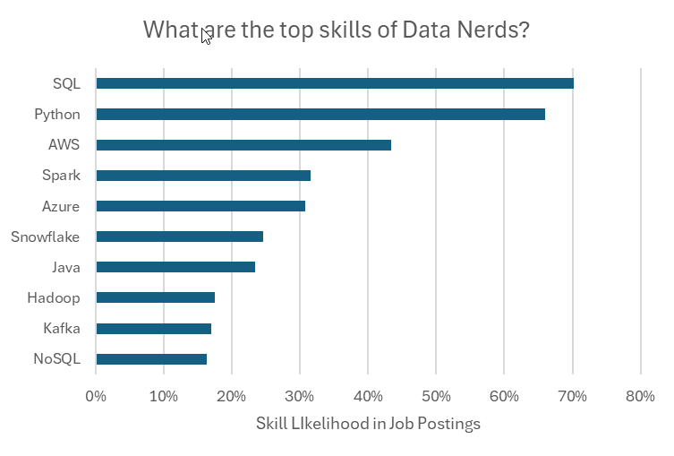

## Project 1 - Excel Salary Dashboard
This project was completed as part of [Luke Barousse’s Excel course](https://www.youtube.com/watch?v=pCJ15nGFgVg&t) to explore and visualize salaries in the data job market. The 2023 dataset includes job titles, salaries, locations, and required skills.

### Tools & Features Used:

- 📉 Charts (Bar Chart, Map Chart)

- 🧮 Formulas and Functions (MEDIAN, FILTER)

- ❎ Data Validation

### Key Insights:

- Senior roles and engineers earn more than analysts.
- Significant salary differences exist between countries.
- Location and job type strongly influence compensation.

### Outcome:
The dashboard provides a quick understanding of market salaries and enhanced my Excel data analysis skills.

**[Read Full Project Details →](Excel_Project_1/README.MD)**

## Project 2 - Data Science Skills
This project, part of Luke Barousse’s Excel course, examines the most in-demand skills for data analysts and their impact on salaries using 2023 job market data.

### Tools & Features Used:

- 📊 Pivot Tables & Pivot Charts
- 🧮 DAX (Data Analysis Expressions)
- 🔍 Power Query
- 💪 Power Pivot

### Key Insights:

- More skills often correlate with higher salaries, especially for senior technical roles.
- Python, SQL, and cloud technologies (AWS, Azure) are linked to top-paying jobs.
- Salary differences between US and non-US roles are significant in high-tech positions.

### Outcome:
The analysis provides a data-driven guide for professionals seeking to boost their market value through targeted skill development.

**[Read Full Project Details →](Excel_Project_2/README.MD)**
