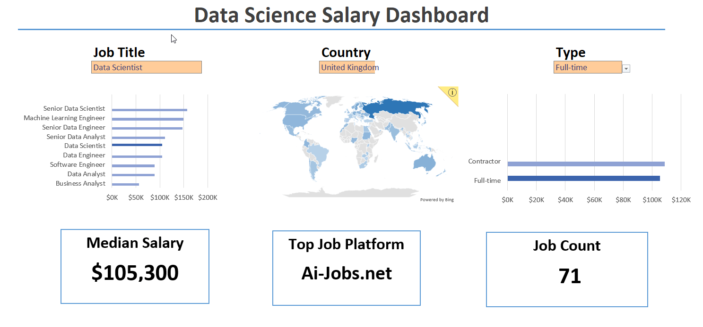

# Excel Salary Dashboard

## Introduction
This salary dashboard was created as part of my learning journey through [Luke Barousse's Excel course.](https://www.youtube.com/watch?v=pCJ15nGFgVg&t) The goal was to explore and visualize salary trends across data-related roles. The dataset includes job titles, salaries, locations, and required skills—providing a practical foundation for understanding how to analyze and present such information effectively.

### Dashboard File
My final dashboard is in [my_dashboard](./Data_Science_Salary_Dashboard.xlsx)
