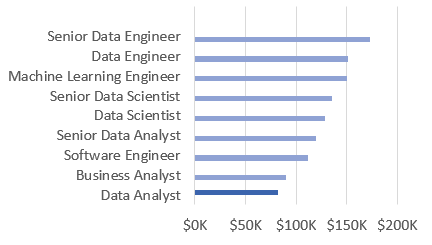
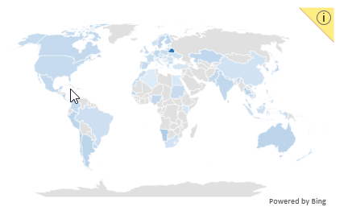
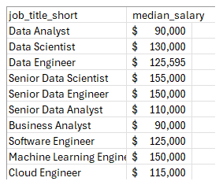
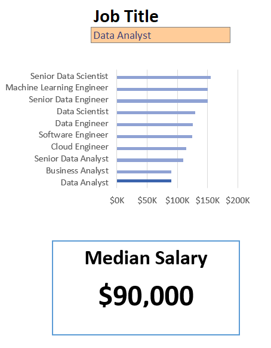
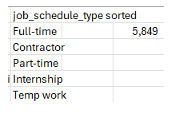
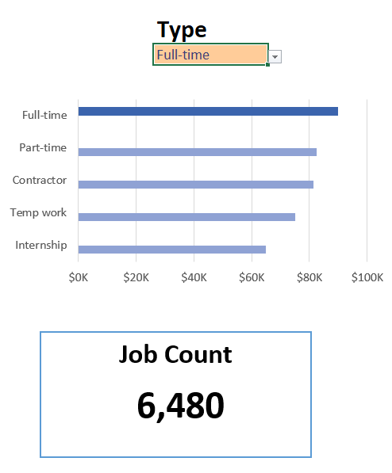
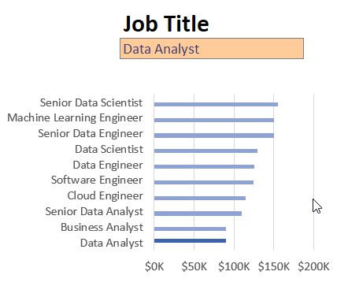

# Excel Salary Dashboard

## Introduction
This salary dashboard was created as part of my learning journey through [Luke Barousse's Excel course.](https://www.youtube.com/watch?v=pCJ15nGFgVg&t) The goal was to explore and visualize salary trends across data-related roles. The dataset includes job titles, salaries, locations, and required skills—providing a practical foundation for understanding how to analyze and present such information effectively.

### Dashboard File
My final dashboard is in [Data_Science_Salary_Dashboard.xlsx](./Data_Science_Salary_Dashboard.xlsx)

### Excel Skills Used
The following Excel skills were utilized for analysis:
- 📉 Charts
- 🧮 Formulas and Functions
- ❎ Data Validation

### Data Jobs Dataset
The dataset used for this project contains real-world data science job information from 2023. The dataset is available via [Luke's course on YouTube](https://www.youtube.com/watch?v=pCJ15nGFgVg&t), which provides a foundation for analyzing data using Excel. It includes detailed information on:
- 👨‍💼 Job titles
- 💰 Salaries
- 📍 Locations
- 🛠️ Skills

## Dashboard Build
### 📉 Charts
#### 📊 Data Science Job Salaries - Bar Chart

- 🛠️ **Excel Features:** Utilized bar chart feature (with formatted salary values) and optimized layout for clarity.
- 🎨 **Design Choice:** Horizontal bar chart for visual comparison of median salaries.
- 📉 **Data Organization:** Sorted job titles by descending salary for improved readability.
- 💡 **Insights Gained:** This enables quick identification of salary trends, noting that Senior roles and Engineers are higher-paying than Analyst roles.

#### 🗺️ Country Median Salaries - Map Chart

- 🛠️ **Excel Features:** Utilized Excel's map chart feature to plot median salaries globally.
- 🎨 **Design Choice:** Color-coded map to visually differentiate salary levels across regions.
- 📊 **Data Representation:** Plotted median salary for each country with available data.
- 👁️ **Visual Enhancement:** Improved readability and immediate understanding of geographic salary trends.
- 💡 **Insights Gained:** Enables quick grasp of global salary disparities and highlights high/low salary regions.

### 🧮 Formulas and Functions
#### 💰 Median Salary by Job Titles

<pre lang="markdown">=MEDIAN(
IF(
    (jobs[job_title_short]=A2)*
    (jobs[job_country]=country)*
    (ISNUMBER(SEARCH(type,jobs[job_schedule_type])))*
    (jobs[salary_year_avg]<>0),
    jobs[salary_year_avg]
)
) 
</pre>

- 🔍 **Multi-Criteria Filtering:** Checks job title, country, schedule type, and excludes blank salaries.
- 📊 **Array Formula:** Utilizes MEDIAN() function with nested IF() statement to analyze an array.
- 🎯 **Tailored Insights:** Provides specific salary information for job titles, regions, and schedule types.
- 🔢 **Formula Purpose:** This formula populates the table below, returning the median salary based on job title, country, and type specified.

🍽️ Background Table

📉 Dashboard Implementation

#### ⏰ Count of Job Schedule Type
<pre lang="markdown">=FILTER(J2#,(NOT(ISNUMBER(SEARCH("and",J2#))+ISNUMBER(SEARCH(",",J2#))))*(J2#<>0))</pre>

- 🔍 **Unique List Generation:** This Excel formula below employs the FILTER() function to exclude entries containing "and" or commas, and omit zero values.
- 🔢 **Formula Purpose:** This formula populates the table below, which gives us a list of unique job schedule types.
🍽️ Background Table

📉 Dashboard Implementation:

## ❎ Data Validation
### 🔍 Filtered List
🔒 **Enhanced Data Validation:** Implementing the filtered list as a data validation rule under the Job Title, Country, and Type option in the Data tab ensures:
- 🎯 User input is restricted to predefined, validated schedule types
- 🚫 Incorrect or inconsistent entries are prevented
- 👥 Overall usability of the dashboard is enhanced

## Conclusion
I built this dashboard to apply the skills I gained in Luke’s Excel course and to better understand salary trends in the data job market in 2023. It helps reveal how factors like job title and location impact compensation. This project not only sharpened my data analysis abilities but also offered valuable insights for anyone navigating a career in data.

